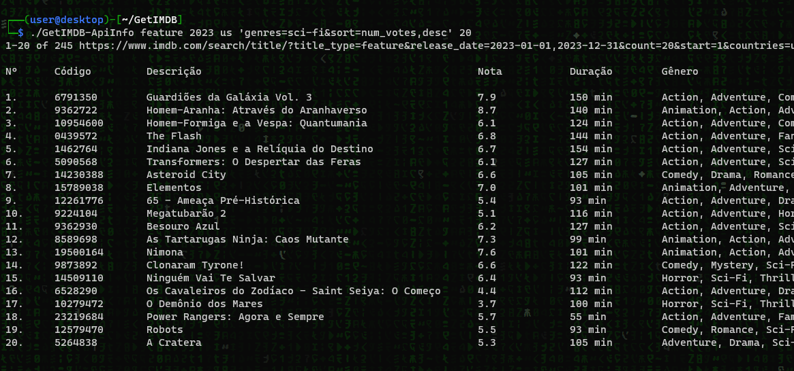

# GetIMDB-ApiInfo - Listagem de Filmes e Séries do IMDb

O `GetIMDB-ApiInfo` é um script de shell que permite listar informações sobre filmes e séries a partir do site IMDb. Ele extrai detalhes sobre filmes e séries diretamente do site e exibe os resultados no terminal.



## Funcionalidades

- Listar informações incluindo título, classificação, ano de lançamento, Duração, Gênero e quantidade de votos.
- Fácil de usar e personalizar de acordo com suas necessidades.


## Uso

1. Clone o repositório:

```shell
git clone https://github.com/denisprdo/GetIMDB-ApiInfo.git
cd GetIMDB
```

2. Utilizando o comando:

Modo de usar:
./GetIMDB-ApiInfo [title_type] [release_date] [countries] [filters_and_sort-by] [lenght_list]

Exemplos:
```
./GetIMDB-ApiInfo feature 2023 us 'genres=sci-fi&sort=num_votes,desc' 20
```

```
GetIMDB-ApiInfo all 2018 all 'groups=oscar_winner&sort=num_votes,desc' 20
```

```
./GetIMDB-ApiInfo all all all 'keywords=hacker&sort=num_votes,desc' 20
```

```
./GetIMDB-ApiInfo feature 2020 all 'keywords=hacker&sort=num_votes,desc'
```

```
./GetIMDB-ApiInfo feature 2020 all 'sort=num_votes,desc' 3
```

```
./GetIMDB-ApiInfo feature 2022 all 'genres=sci-fi&sort=num_votes,desc' 10
```

```
./GetIMDB-ApiInfo tv_miniseries 2020 all 'sort=num_votes,desc' 10
```

```
./GetIMDB-ApiInfo tv_series 2022 all 'sort=num_votes,desc' 10
```

3. Consultar documentação:

```
./GetIMDB-ApiInfo -h
```
ou
```
./GetIMDB-ApiInfo --help
```
